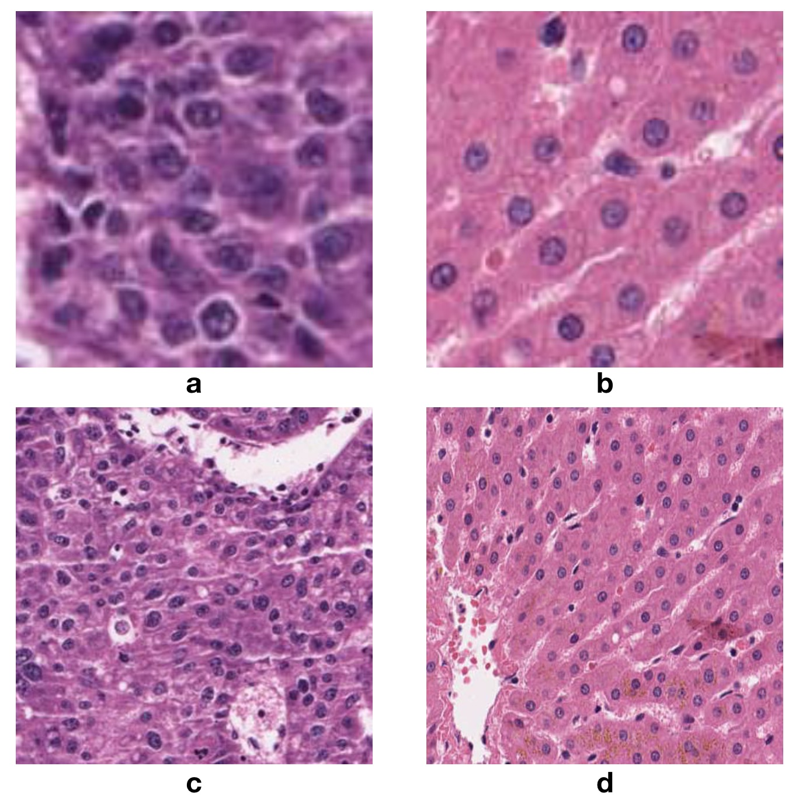
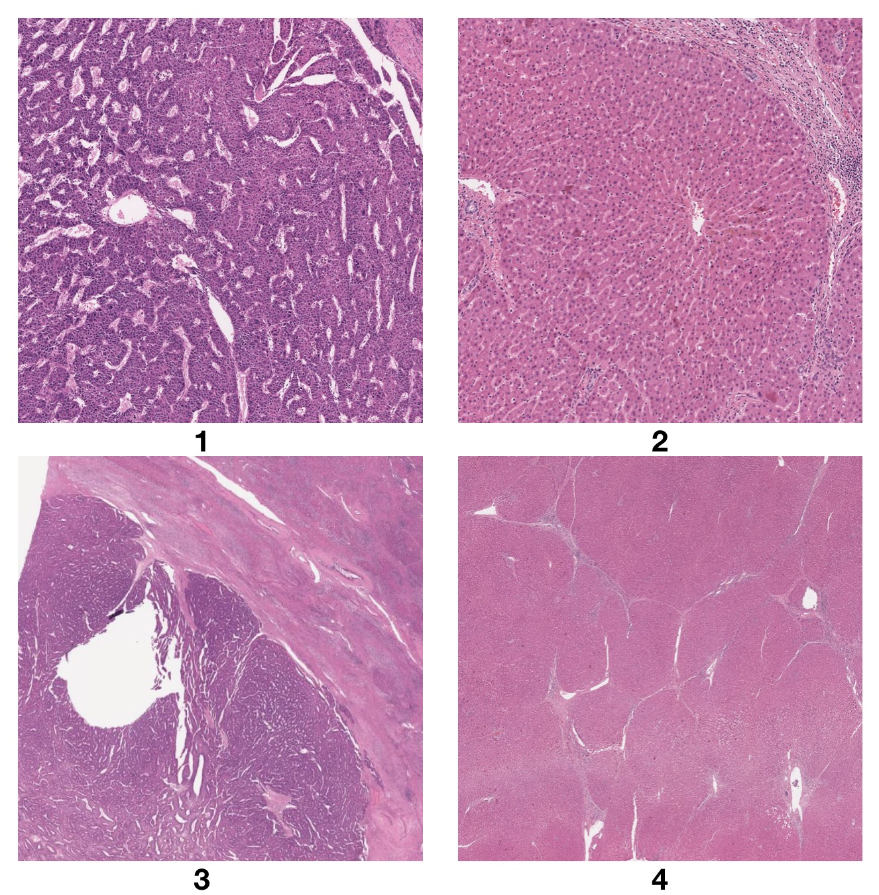
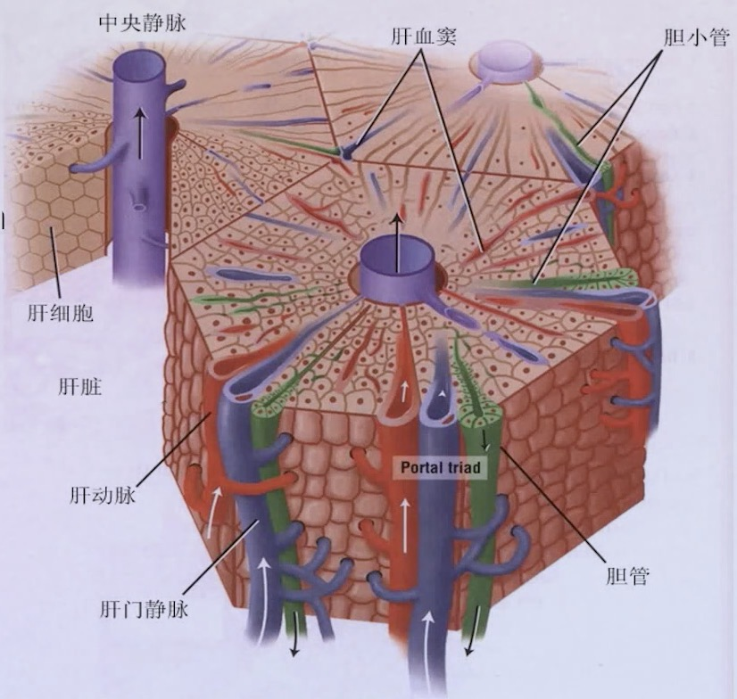
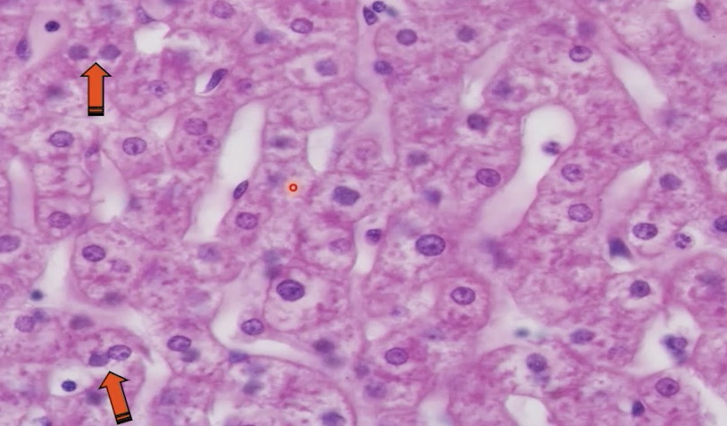
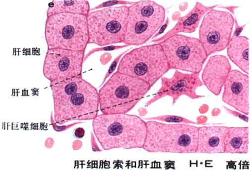

# 肝的组织学特征
> 今天我的肝怎么样了呀

## 学习前言
原来组织学和病理学都这么简单鸭

## 肝细胞癌 vs 正常的肝

* 肝细胞癌a：细胞核大且深，细胞间质少
* 正常肝b：细胞核颜色较小且浅，细胞间质多
* 肝细胞癌c：细胞核大且深，排列没有规则
* 正常肝d：肝细胞呈索状排列，肝板之间有空隙

* 肝细胞癌1: 颜色很深，结构乱乱的
* 正常肝2: 这是一个肝小叶
* 肝细胞癌3: 还是颜色深，外面有个假包膜，一眼就看出来惹
* 正常肝4: 好多个分界不是很明显的肝小叶

## 肝小叶（hepatic lobule）
> 肝结构与功能的基本结构单位

* 多面棱柱体，高2mm，**宽1mm**（取patch的大小？）
* CV: central vein; PT: Portal triad; 似乎大家都用CV和PT所在位置判断H&E染色图上的肝小叶位置。

## 肝细胞

>大，立方形或多边形，核圆，有双核，胞质嗜酸性（红？），有嗜碱性颗粒（蓝？）

箭头是双核存在的地方

## 肝板/肝索（hepatic cord/plate）

> 单行肝细胞围绕中央静脉放射状排列形成的

* 横断面--成索状（肝索）：用人话来说肝细胞排成了一条。
* 立体--板状（肝板）：一条一条肝索堆叠成了一块板。

## 肝血窦（hepatic sinusoid）

## 门管区（protal area）
> 肝小叶之间的三角